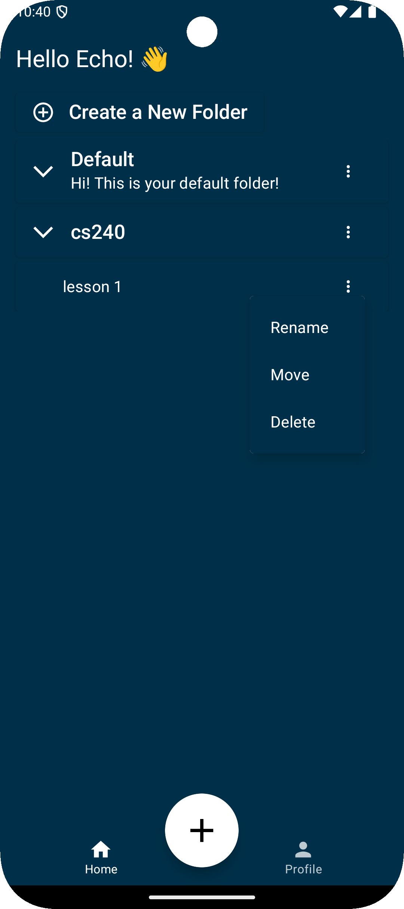
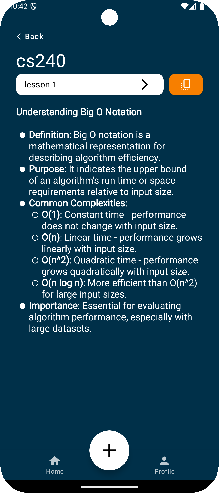
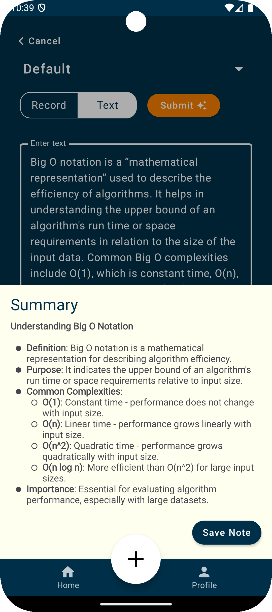

# EchoNote

EchoNote is a convenient mobile app designed to help students efficiently capture and organize information presented during lectures and office hours using AI.

    
    
    

## Team Details

#### Team Members
Andy Zhu - andy.zhu1@uwaterloo.ca  
Kyle Zhou - kyle.zhou@uwaterloo.ca  
Gen Ichihashi - gichihas@uwaterloo.ca  
Yarik Popov - yepopov@uwaterloo.ca

#### Team Number
102-14

#### Team Contract
Wiki link to: [Team Contract](../../wikis/Team-Contract)

## Meta

##### Platform Definition
Android/mobile

## Project Links
- [Project Proposal](../../wikis/Project-Proposal)
- [Design Proposal](../../wikis/Design-Proposal)
- [Meeting Minutes](../../wikis/Meeting-Minutes)
- [User Documentation](../../wikis/User-Documentation)

## Releases
- [Version 1.1.0 Release](../../wikis/Version-1.1.0-Releases)
- [Version 1.2.0 Release](../../wikis/Version-1.2.0-Releases)
- [Version 1.3.0 Release](../../wikis/Version-1.3.0-Releases)

## Planned Features

## Versions

## Acknowledgements

